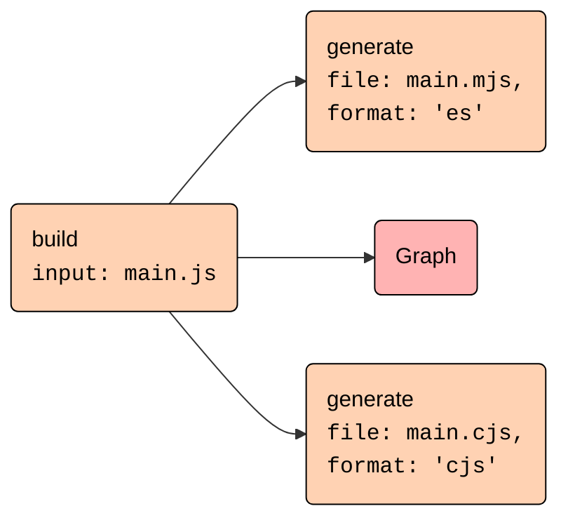

# High-level architecture

## Rollup core, Rollup CLI and the browser build

The [`rollup`](https://www.npmjs.com/package/rollup) package contains both Rollup's Node.js JavaScript interface and the command-line-interface (CLI). There is a separate browser build available as [`@rollup/browser`](https://www.npmjs.com/package/@rollup/browser).

- The [`rollup.config.ts`](rollup.config.ts) orchestrates building the ESM and CommonJS versions of the JavaScript interface, the CLI, which is an extension of and shares code with the CommonJS build, and the browser build.
- The JavaScript interface contains the core logic.
  - It is mostly environment agnostic.
    - To achieve full environment independence in the browser build, [`replace-browser-modules.ts`](build-plugins/replace-browser-modules.ts) replaces some modules with modified browser versions that reside in the [`browser` folder](browser).
    - The most prominent difference is the fact that there is no fallback logic for the `resolveId` and `load` plugin hooks. If there is no plugin implementing those hooks for a file, the browser build will fail.
  - The entry point for the Node.js build is [`node-entry.ts`](src/node-entry.ts) while the browser build uses [`browser-entry.ts`](src/browser-entry.ts). Those are mostly identical except that the browser build does not expose the watch mode interface.
- The CLI is a wrapper around the JavaScript interface.
  - It resides in the [`cli` folder](cli) with the entry point [cli.ts](cli/cli.ts).
  - The logic to read configuration files resides in [locaConfigFile.ts](cli/run/loadConfigFile.ts) and is exposed as a separate export via `import { loadConfigFile } from "rollup/loadConfigFile"`.
  - Only the CLI is able to handle arrays of configurations. Those are handled sequentially in [`run/index.ts`](cli/run/index.ts).
  - The CLI handles several CLI-only options that are specific to the Node.js environment like setting environment variables or handling std-in, see [Command line flags](docs/command-line-interface/index.md#command-line-flags).

### Native code and Web Assembly

The `rollup` package relies on optional dependencies to provide platform-specific native code. These are not listed in the committed `package.json` file but are added dynamically during publishing. This logic is handled by [`napi-rs`](https://napi.rs) via `npm run prepublish:napi` from [`scripts/prepublish.js`](scripts/prepublish.js).

In general, the native modules are built and published from GitHub Actions whenever a new release version tag is pushed.

As native modules do not work for the browser build, we use [`wasmpack`](https://rustwasm.github.io/docs/wasm-pack/) to build a WebAssembly artefact. This is triggered from `npm run build` via `npm run build:wasm`. There is also a separate Node wasm build that is again triggered from GitHub actions via `npm run build:wasm:node`.

From JavaScript, native code is imported by importing [`native.js`](native.js). This module, or its WebAssembly version [`native.wasm.js`](native.wasm.js), is [copied](build-plugins/emit-native-entry.ts) as `native.js` into the output folder during build (via [`publish-wasm-node-package.js`](scripts/publish-wasm-node-package.js) for WebAssembly). Imports of this module are [declared external](build-plugins/external-native-import.ts).

The Rust entrypoints are [`bindings_napi/src/lib.rs`](rust/bindings_napi/src/lib.rs) for the native modules and [`bindings_wasm/src/lib.rs`](rust/bindings_wasm/src/lib.rs) for WebAssembly.

## The build and generate phases

Building an output has two phases

- the "build" phase

