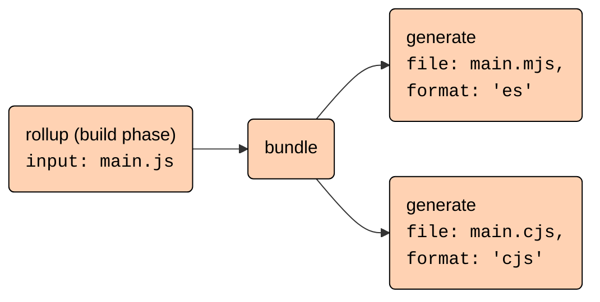

# High-level architecture

## Rollup packages

- The [`rollup`](https://www.npmjs.com/package/rollup) npm package contains both Rollup's Node.js JavaScript interface and the command-line-interface (CLI).
- There is a separate browser build available as [`@rollup/browser`](https://www.npmjs.com/package/@rollup/browser). It exposes the same JavaScript interface as the Node.js build but does not include the CLI and also requires writing a plugin to encapsulate file reading. Instead of native code dependencies, this build has a bundled WASM artifact included that can be loaded in the browser. This is what the [Rollup REPL](https://rollupjs.org/repl) uses.
- For every supported platform-architecture combination, there is a separate pacakge containing the native code. These are not listed in the committed `package.json` file but are added dynamically during publishing as `optionalDependencies`. The `README.md` and `package.json` files for those dependencies can be found in the [`npm`](npm) folder. The corresponding binaries are built and published from [GitHub Actions](.github/workflows/build-and-tests.yml) whenever a new release version tag is pushed. The actual loading of the native code is handled by [`native.js`](native.js) which is copied into the output folder during build. So to add a new platform-architecture combination, you need to
  - add a new package in the `npm` folder
  - update the `native.js` file
  - add the corresponding triple to the [`package.json`](package.json) file as napi-rs depends on this
  - extend the [GitHub Actions workflow](.github/workflows/build-and-tests.yml) to build the new package
- There is also a separate `@rollup/wasm-node` package that is identical to the `rollup` package in that it contains the Node.js JavaScript interface and the CLI but does not contain any native code. Instead, it includes a WebAssembly artifact that runs in Node.js. This package and the corresponding artifact only built on GitHub Actions and published via the [`publish-wasm-node-package.js`](scripts/publish-wasm-node-package.js) script.

## Building Rollup

### JavaScript interface and CLI

- The [`rollup.config.ts`](rollup.config.ts) orchestrates building the ESM and CommonJS versions of the JavaScript interface, the CLI, which is an extension of and shares code with the CommonJS build, and the browser build.
  - `npm run build:js` builds all JavaScript artifacts. However, as it includes the browser build, it requires the browser Web Assembly artifact to be built first, otherwise the build will fail.
- The JavaScript interface contains the core logic.
  - It is mostly environment agnostic.
    - To achieve full environment independence in the browser build, [`replace-browser-modules.ts`](build-plugins/replace-browser-modules.ts) replaces some modules with modified browser versions that reside in the [`browser` folder](browser).
    - The most prominent difference is the fact that there is no fallback logic for the `resolveId` and `load` plugin hooks. If there is no plugin implementing those hooks for a file, the browser build will fail.
  - The entry point for the Node.js build is [`node-entry.ts`](src/node-entry.ts) while the browser build uses [`browser-entry.ts`](src/browser-entry.ts). Those are mostly identical except that the browser build does not expose the watch mode interface.
- The CLI is a wrapper around the JavaScript interface.
  - It resides in the [`cli` folder](cli) with the entry point [cli.ts](cli/cli.ts).
  - The logic to read configuration files resides in [locaConfigFile.ts](cli/run/loadConfigFile.ts) and is exposed as a separate export via `import { loadConfigFile } from "rollup/loadConfigFile"`.
  - Only the CLI is able to handle arrays of configurations. Those are handled sequentially in [`run/index.ts`](cli/run/index.ts).
  - The CLI handles several CLI-only options that are specific to the Node.js environment like setting environment variables or handling std-in, see [Command line flags](docs/command-line-interface/index.md#command-line-flags).

### Native code and Web Assembly

The `rollup` package relies on optional dependencies to provide platform-specific native code. These are not listed in the committed `package.json` file but are added dynamically during publishing. This logic is handled by [`napi-rs`](https://napi.rs) via `npm run prepublish:napi` from [`scripts/prepublish.js`](scripts/prepublish.js).

As native modules do not work for the browser build, we use [`wasmpack`](https://rustwasm.github.io/docs/wasm-pack/) to build a WebAssembly artefact. This is triggered from `npm run build` via `npm run build:wasm`. There is also a separate Node wasm build that is again triggered from GitHub actions via `npm run build:wasm:node`.

From JavaScript, native code is imported by importing [`native.js`](native.js). This module, or its WebAssembly version [`native.wasm.js`](native.wasm.js), is [copied](build-plugins/emit-native-entry.ts) as `native.js` into the output folder during build (via [`publish-wasm-node-package.js`](scripts/publish-wasm-node-package.js) for WebAssembly). Imports of this module are [declared external](build-plugins/external-native-import.ts).

The Rust entrypoints are [`bindings_napi/src/lib.rs`](rust/bindings_napi/src/lib.rs) for the native modules and [`bindings_wasm/src/lib.rs`](rust/bindings_wasm/src/lib.rs) for WebAssembly.

## The build and generate phases

Building an output has two phases

- The "build" phase builds a module graph form the input files and decides, which code should be included in the output
  - It is triggered by calling the `rollup(inputOptions)` function exported by the JavaScript interface
  - It returns a "bundle" object that has `generate` and `write` methods
- The "generate" phase generates the output files from the bundle by calling `.generate(outputOptions)` or `.write(outputOptions)`
  - The main difference is that `.write` will write the files to disk while `.generate` just returns the output in-memory. Hence `.write` requires the [`file`](https://rollupjs.org/configuration-options/#output-file) or [`dir`](https://rollupjs.org/configuration-options/#output-dir) options to be set while `.generate` does not.
  - It is possible to generate multiple outputs from the same bundle e.g. with different formats
  - As code-splitting is also part of the "generate" phase, output can also use [`preserveModules`](https://rollupjs.org/configuration-options/#output-preservemodules) to keep the file structure or [`inlineDynamicImports`](https://rollupjs.org/configuration-options/#output-inlinedynamicimports) to inline dynamic imports, albeit at the cost of some semantic changes.

On the highest level, all of this is orchestrated by the `rollupInternal` function in [`rollup.ts`](src/rollup/rollup.ts). This function

- Parses and normalizes the input options via [`normalizeInputOptions`](src/utils/options/normalizeInputOptions.ts)
- Initializes the [`Graph`](src/Graph.ts) object
- Triggers the actual build phase via `Graph.build()`
- Generates the "bundle" object with the `.generate` and `.write` methods
- These methods in turn first parse and normalize the output options via [`normalizeOutputOptions`](src/utils/options/normalizeOutputOptions.ts)
- Then they create the [`Bundle`](src/Bundle.ts) object that manages one output
- Last, they trigger the actual generate phase via `Bundle.generate()`

## The build phase

In detail, the `Graph.build` performs the following steps

- it reads all entry points provided by the [`input`](https://rollupjs.org/configuration-options/#input) option and additional entry points emitted from plugins via [`this.emitFile()`](https://rollupjs.org/plugin-development/#this-emitfile).
-
