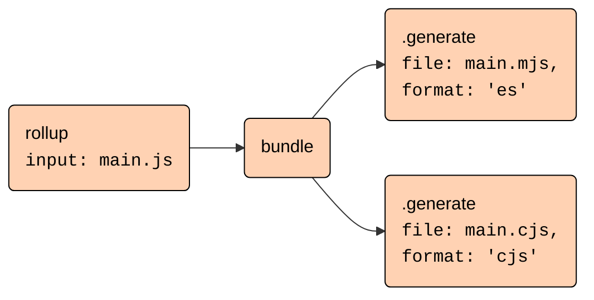

# High-level architecture

## Rollup packages

- The [`rollup`](https://www.npmjs.com/package/rollup) npm package contains both Rollup's Node.js JavaScript interface and the command-line-interface (CLI).
- There is a separate browser build available as [`@rollup/browser`](https://www.npmjs.com/package/@rollup/browser). It exposes the same JavaScript interface as the Node.js build but does not include the CLI and also requires writing a plugin to encapsulate file reading. Instead of native code dependencies, this build has a bundled WASM artifact included that can be loaded in the browser. This is what the [Rollup REPL](https://rollupjs.org/repl) uses.
- For every supported platform-architecture combination, there is a separate package containing the native code. These are not listed in the committed `package.json` file but are added dynamically during publishing as `optionalDependencies`. The `README.md` and `package.json` files for those dependencies can be found in the [`npm`](npm) folder. The corresponding binaries are built and published from [GitHub Actions](.github/workflows/build-and-tests.yml) whenever a new release version tag is pushed. The actual loading of the native code is handled by [`native.js`](native.js) which is copied into the output folder during build. So to add a new platform-architecture combination, you need to
  - add a new package in the `npm` folder
  - update the `native.js` file
  - add the corresponding triple to the [`package.json`](package.json) file as napi-rs depends on this
  - extend the [GitHub Actions workflow](.github/workflows/build-and-tests.yml) to build the new package
- There is also a separate `@rollup/wasm-node` package that is identical to the `rollup` package in that it contains the Node.js JavaScript interface and the CLI but does not contain any native code. Instead, it includes a WebAssembly artifact that runs in Node.js. This package and the corresponding artifact only built on GitHub Actions and published via the [`publish-wasm-node-package.js`](scripts/publish-wasm-node-package.js) script.

## Building Rollup

### JavaScript interface and CLI

- The [`rollup.config.ts`](rollup.config.ts) orchestrates building the ESM and CommonJS versions of the JavaScript interface, the CLI, which is an extension of and shares code with the CommonJS build, and the browser build.
  - `npm run build:js` builds all JavaScript artifacts. However, as it includes the browser build, it requires the browser Web Assembly artifact to be built first, otherwise the build will fail.
- The JavaScript interface contains the core logic.
  - It is mostly environment agnostic.
    - To achieve full environment independence in the browser build, [`replace-browser-modules.ts`](build-plugins/replace-browser-modules.ts) replaces some modules with modified browser versions that reside in the [`browser` folder](browser).
    - The most prominent difference is the fact that there is no fallback logic for the `resolveId` and `load` plugin hooks. If there is no plugin implementing those hooks for a file, the browser build will fail.
  - The entry point for the Node.js build is [`node-entry.ts`](src/node-entry.ts) while the browser build uses [`browser-entry.ts`](src/browser-entry.ts). Those are mostly identical except that the browser build does not expose the watch mode interface.
- The CLI is a wrapper around the JavaScript interface.
  - It resides in the [`cli` folder](cli) with the entry point [cli.ts](cli/cli.ts).
  - The logic to read configuration files resides in [loadConfigFile.ts](cli/run/loadConfigFile.ts) and is exposed as a separate export via `import { loadConfigFile } from "rollup/loadConfigFile"`.
  - Only the CLI is able to handle arrays of configurations. Those are handled sequentially in [`run/index.ts`](cli/run/index.ts).
  - The CLI handles several CLI-only options that are specific to the Node.js environment like setting environment variables or handling std-in, see [Command line flags](docs/command-line-interface/index.md#command-line-flags).

### Native code and Web Assembly

The `rollup` package relies on optional dependencies to provide platform-specific native code. These are not listed in the committed `package.json` file but are added dynamically during publishing. This logic is handled by [`napi-rs`](https://napi.rs) via `npm run prepublish:napi` from [`scripts/prepublish.js`](scripts/prepublish.js).

As native modules do not work for the browser build, we use [`wasmpack`](https://rustwasm.github.io/docs/wasm-pack/) to build a WebAssembly artefact. This is triggered from `npm run build` via `npm run build:wasm`. There is also a separate Node wasm build that is again triggered from GitHub actions via `npm run build:wasm:node`.

From JavaScript, native code is imported by importing [`native.js`](native.js). This module, or its WebAssembly version [`native.wasm.js`](native.wasm.js), is [copied](build-plugins/emit-native-entry.ts) as `native.js` into the output folder during build (via [`publish-wasm-node-package.js`](scripts/publish-wasm-node-package.js) for WebAssembly). Imports of this module are [declared external](build-plugins/external-native-import.ts).

The Rust entrypoints are [`bindings_napi/src/lib.rs`](rust/bindings_napi/src/lib.rs) for the native modules and [`bindings_wasm/src/lib.rs`](rust/bindings_wasm/src/lib.rs) for WebAssembly.

## The build and generate phases

Building an output has two phases

- The "build" phase builds a module graph from the input files and decides, which code should be included in the output
  - It is triggered by calling the `rollup(inputOptions)` function exported by the JavaScript interface
  - It returns a "bundle" object that has `generate` and `write` methods
- The "generate" phase generates the output files from the bundle by calling `.generate(outputOptions)` or `.write(outputOptions)`
  - The main difference is that `.write` will write the files to disk while `.generate` just returns the output in-memory. Hence `.write` requires the [`file`](https://rollupjs.org/configuration-options/#output-file) or [`dir`](https://rollupjs.org/configuration-options/#output-dir) options to be set while `.generate` does not.
  - It is possible to generate multiple outputs from the same bundle e.g. with different formats
  - As code-splitting is also part of the "generate" phase, outputs can also use [`preserveModules`](https://rollupjs.org/configuration-options/#output-preservemodules) to keep the file structure or [`inlineDynamicImports`](https://rollupjs.org/configuration-options/#output-inlinedynamicimports) to inline dynamic imports, albeit at the cost of some semantic changes.

On the highest level, all of this is orchestrated by the `rollupInternal` function in [`rollup.ts`](src/rollup/rollup.ts). This function

- Parses and normalizes the input options via [`normalizeInputOptions`](src/utils/options/normalizeInputOptions.ts)
- Initializes the [`Graph`](src/Graph.ts) instance
- Triggers the actual build phase via `Graph.build()`
- Generates the "bundle" object with the `.generate` and `.write` methods
- These methods in turn first parse and normalize the output options via [`normalizeOutputOptions`](src/utils/options/normalizeOutputOptions.ts)
- Then they create a [`Bundle`](src/Bundle.ts) instance that manages one output
- Last, they trigger the actual generate phase via `Bundle.generate()`

### The build phase

To understand this phase from a plugin perspective, have a look at [Build Hooks](https://rollupjs.org/plugin-development/#build-hooks), which also contains a graph to show in which order these hooks are executed. In detail, `Graph.build` performs the following steps

- It generates the module graph. This is orchestrated by the [`ModuleLoader`](src/ModuleLoader.ts) class. This class
  - Reads all entry points provided by the [`input`](https://rollupjs.org/configuration-options/#input) option and additional entry points emitted from plugins via [`this.emitFile()`](https://rollupjs.org/plugin-development/#this-emitfile).
  - For each module, it first creates a [`Module`](src/Module.ts) instance.
  - Then it loads and transforms the code via the corresponding plugin hooks.
  - The resulting code and sourcemaps are passed to the `Module` instance via `Module.setSource()`.
  - This parses the code into the Rollup AST, which consists of the classes defined in the [ast folder](src/ast/nodes). For details see also [below](#parsing-the-ast).
  - In the process, it also collects all static and dynamic dependencies of the module.
  - These are then again loaded and transformed by the `ModuleLoader`, a process that repeats until the graph is complete.
- It sorts the modules by their execution order to assign an `execIndex` to each module in [`executionOrder.ts`](src/utils/executionOrder.ts).
- It marks which statements in each module are included in the output, also known as "tree-shaking"
  - This happens in several passes. Each pass starts with calling `.include` on the `Module` instance.
  - This again calls `.include` on the top-level AST node, that is then propagated to the child nodes. At several stages, inclusion will only happen if a statement or expression has "side effects", which is determined by calling its `.hasEffects` method. Usually, it means mutating a variable that is already included or performing an action where we cannot determine whether there are side effects like calling a global function.
  - Nodes that are already included are included again for each pass as it is possible that with each pass, some additional child nodes may need to be included. Whenever something new is included, another pass will be scheduled once the current pass is finished.
  - In the end, it sets `.included` flags on the AST nodes that are then picked up by the rendering logic in the "generate" phase.

### The generate phase

To understand this phase from a plugin perspective, have a look at [Output Generation Hooks](https://rollupjs.org/plugin-development/#output-generation-hooks), which again contains a graph to show in which order these hooks are executed. In detail `Bundle.generate` performs the following steps

- Assign modules to chunks via [`chunkAssignment.ts`](src/utils/chunkAssignment.ts)
- Determine the exports for each chunk by tracing the included inter-module dependencies
- Render the chunks, which is orchestrated by the [`renderChunks`](src/utils/renderChunks.ts) helper
  - Render the chunks with placeholders for chunk hashes by calling `Chunk.render()`
    - Determine how dynamic imports and `import.meta` references should be resolved and store this on the corresponding AST nodes.
    - Determine the final deconflicted variable names and store those on the AST nodes as well in [`deconflictChunk.ts`](src/utils/deconflictChunk.ts)
    - Render each module by calling the `.render` methods of their AST nodes. This is also where tree-shaken nodes are removed from the output.
    - Render the format specific wrapper with imports and exports for this chunk by calling the corresponding [finaliser](src/finalisers).
  - Transform the rendered chunks via the [`renderChunk`](https://rollupjs.org/plugin-development/#renderchunk) plugin hook
  - Determine the final chunk hashes based on the actual rendered content and the chunk dependency graph and replace the placeholders

## Parsing the AST

Rollup parses code within the native/WebAssembly code. As most of Rollup is still TypeScript-based, this then needs to be transformed to a JavaScript representation. To do that efficiently, a binary buffer is constructed in Rust that can be passed without copying to TypeScript where it is further transformed.

- The conversion to a buffer happens mostly within [`converter.rs`](rust/parse_ast/src/convert_ast/converter.rs). Here we also make sure that the buffer follows the format of the [ESTree specification](https://github.com/estree/estree).
- While the converter is still mostly hand-written, it relies on auto-generated constants to ensure that the encoder and decoder match. These are generated together with the decoders from [`generate-ast-converters.js`](scripts/generate-ast-converters.js) via `npm run build:ast-converters`. The definitions for the auto-generated converters can be found in [`ast-types.js`](scripts/ast-types.js), which is also the first file that needs to be extended to support additional AST nodes.

There are two ways Rollup parses code into an abstract syntax tree

- When a plugin calls [`this.parse`](https://rollupjs.org/plugin-development/#this-parse). This is a synchronous operation that returns a JSON-AST of the provided code.
  - This will likely be deprecated eventually in favor of an asynchronous method that also does not directly return the JSON representation but rather a Proxy-based representation with efficient methods for traversal and manipulation.
  - For this, the buffer is decoded within the auto-generated file [`bufferToAst.ts`](src/utils/bufferToAst.ts).
- When a module has been loaded. In this case, it is triggered in the `setSource` method of the [`Module`](src/Module.ts) class.
  - Here, the buffer is directly used to generate the class-based Rollup-internal AST.
  - The actual conversion happens in the auto-generated file [`bufferParsers.ts`](src/ast/bufferParsers.ts).

In general, when extending the AST parsing capabilities, the following places need to be touched:

- declare any new AST nodes or additional AST attributes in [`ast-types.js`](scripts/ast-types.js).
- write the encoder in Rust in [`converter.rs`](rust/parse_ast/src/convert_ast/converter.rs).
- create the corresponding TypeScript classes in [`ast/nodes`](src/ast/nodes).
